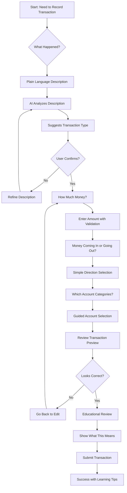
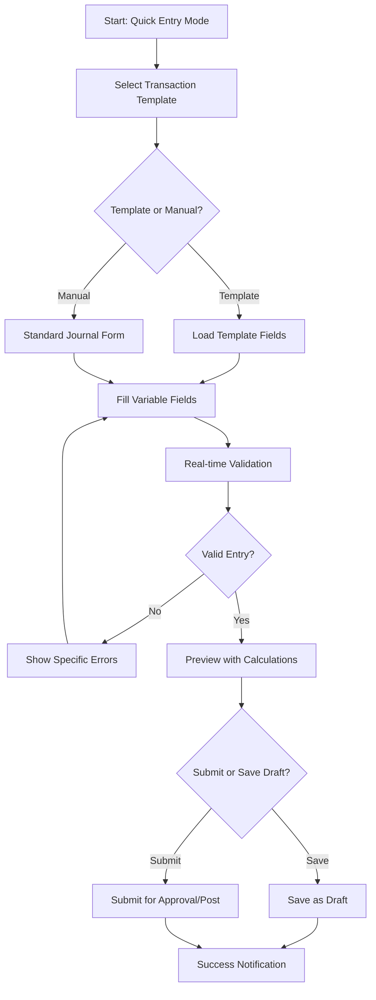
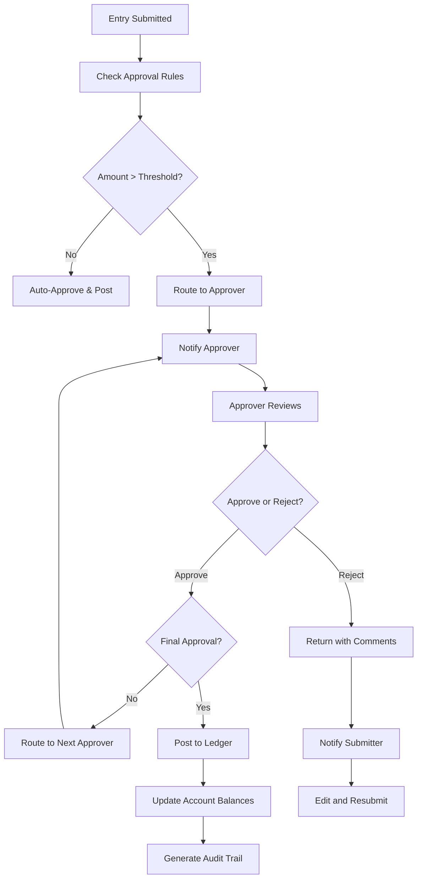
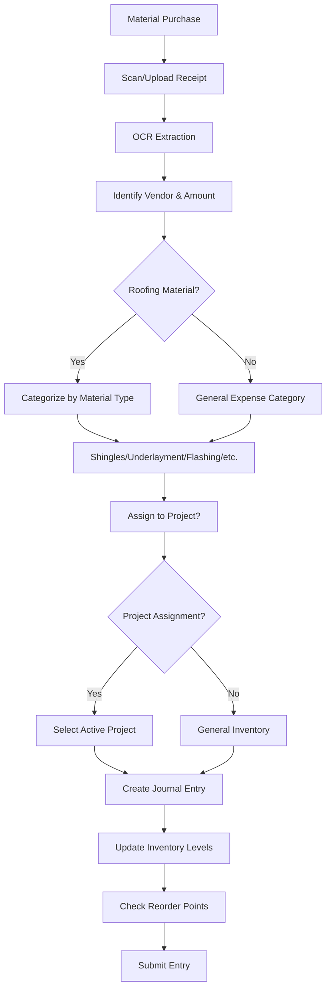
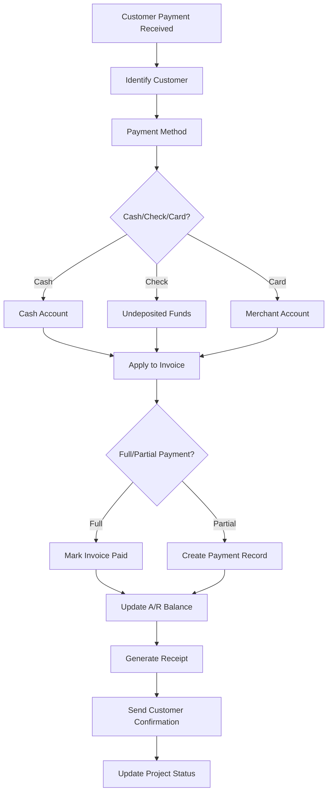
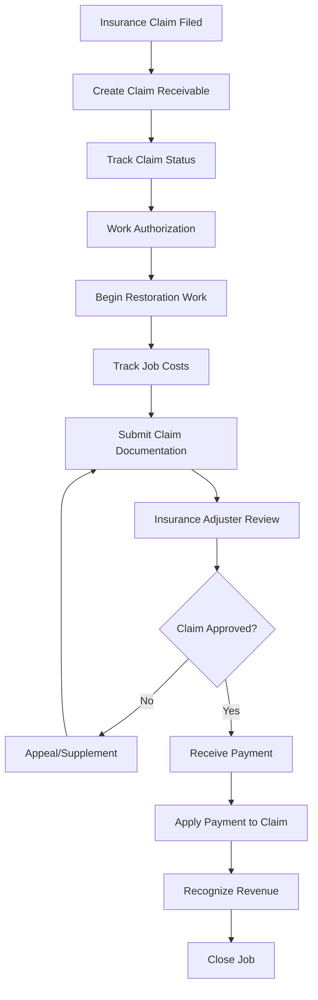
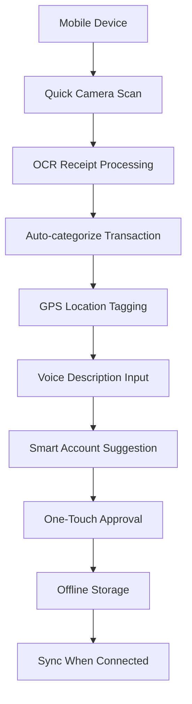

# User Workflow Diagrams and Business Logic

## Overview
Comprehensive workflow design for the Florida First Roofing journal entries system, accommodating users from complete beginners to experienced CFOs while maintaining GAAP compliance and preventing accounting errors.

## User Personas and Workflow Paths

### 1. Beginner Entrepreneur (Small Business Owner)
**Profile**: Limited accounting knowledge, needs guidance
**Goals**: Record transactions accurately without making mistakes
**Workflow**: Guided, template-driven, educational

### 2. Office Manager (Intermediate User)
**Profile**: Basic bookkeeping knowledge, handles day-to-day transactions
**Goals**: Efficient data entry, error prevention, basic reporting
**Workflow**: Quick entry with smart suggestions, automated validation

### 3. Accountant/Bookkeeper (Advanced User)
**Profile**: Professional accounting knowledge, handles complex transactions
**Goals**: Full control, bulk operations, compliance management
**Workflow**: Traditional interface with advanced features

### 4. CFO/MBA (Expert User)
**Profile**: Strategic financial management, oversight responsibilities
**Goals**: Analysis, compliance oversight, strategic decision support
**Workflow**: Dashboard-driven, approval management, reporting focus

---

## Primary Workflow Diagrams

### Workflow 1: Beginner Transaction Entry



**Key Features:**
- **Plain language prompts**: "What did you buy?" instead of "Debit account?"
- **Visual confirmations**: Show money flow with icons and colors
- **Educational overlays**: Explain what's happening in accounting terms
- **Error prevention**: Validate at each step with helpful messages
- **Template learning**: System learns user patterns for future suggestions

### Workflow 2: Quick Entry for Experienced Users



### Workflow 3: Approval Management Process



---

## Roofing Business-Specific Workflows

### Workflow 4: Material Purchase Transaction



**Business Logic:**
```typescript
interface MaterialPurchaseLogic {
  // Automatic categorization based on vendor
  categorizeByVendor(vendor: string): MaterialCategory;

  // Project cost allocation
  allocateToProject(amount: number, projectId: string): AllocationResult;

  // Inventory management integration
  updateInventoryLevels(materials: MaterialItem[]): void;

  // Cost tracking for job costing
  trackJobCosts(projectId: string, costs: CostItem[]): void;
}

// Validation Rules
const materialPurchaseRules = {
  requireReceiptForAmountOver: 100,
  requireProjectAssignmentForMaterials: true,
  validateVendorIsApproved: true,
  checkBudgetVariance: true
};
```

### Workflow 5: Customer Payment Processing



**Business Logic:**
```typescript
interface CustomerPaymentLogic {
  // Payment application logic
  applyPaymentToInvoices(
    customerId: string,
    amount: number,
    paymentDate: Date
  ): PaymentAllocation[];

  // Aging calculation
  calculateAging(customerId: string): AgingReport;

  // Credit limit checking
  checkCreditLimit(customerId: string, newChargeAmount: number): boolean;

  // Payment terms enforcement
  calculateLateFees(invoiceId: string): number;
}

// Auto-application rules
const paymentApplicationRules = {
  applyToOldestFirst: true,
  allowPartialPayments: true,
  requireExactMatch: false,
  autoCreateWriteOffs: false
};
```

### Workflow 6: Insurance Claim Processing



---

## Business Logic Components

### 1. Double-Entry Validation Engine

```typescript
class DoubleEntryValidator {
  validateEntry(entry: JournalEntry): ValidationResult {
    const rules = [
      this.validateBalances,
      this.validateAccountTypes,
      this.validateFiscalPeriod,
      this.validateDocumentation,
      this.validateApprovalLimits
    ];

    return this.runValidationRules(entry, rules);
  }

  private validateBalances(entry: JournalEntry): ValidationCheck {
    const totalDebits = entry.lines
      .reduce((sum, line) => sum + line.debit, 0);
    const totalCredits = entry.lines
      .reduce((sum, line) => sum + line.credit, 0);

    const difference = Math.abs(totalDebits - totalCredits);

    return {
      passed: difference < 0.01, // Allow for rounding
      message: difference > 0.01
        ? `Entry is out of balance by $${difference.toFixed(2)}`
        : 'Entry is in balance',
      severity: difference > 0.01 ? 'error' : 'success'
    };
  }

  private validateAccountTypes(entry: JournalEntry): ValidationCheck {
    const invalidCombinations = [
      { debit: 'REVENUE', credit: 'EXPENSE' }, // Unusual but not impossible
      { debit: 'LIABILITY', credit: 'LIABILITY' } // Likely error
    ];

    // Check for unusual account combinations
    return this.checkAccountCombinations(entry, invalidCombinations);
  }
}
```

### 2. GAAP Compliance Engine

```typescript
class GAAPComplianceChecker {
  checkCompliance(entry: JournalEntry): ComplianceResult {
    return {
      doubleEntryCompliance: this.checkDoubleEntry(entry),
      revenueRecognition: this.checkRevenueRecognition(entry),
      matchingPrinciple: this.checkMatchingPrinciple(entry),
      periodClosureCompliance: this.checkPeriodClosure(entry),
      supportingDocuments: this.checkDocumentation(entry),
      overallCompliance: this.calculateOverallScore(entry)
    };
  }

  private checkRevenueRecognition(entry: JournalEntry): ComplianceCheck {
    // For roofing business: Revenue should be recognized when work is completed
    const revenueLines = entry.lines.filter(line =>
      line.account.type === 'REVENUE'
    );

    if (revenueLines.length > 0) {
      return {
        compliant: this.hasWorkCompletionEvidence(entry),
        message: 'Revenue recognition requires completion documentation',
        recommendation: 'Attach completion certificate or customer sign-off'
      };
    }

    return { compliant: true, message: 'No revenue recognition issues' };
  }
}
```

### 3. Roofing Business Intelligence

```typescript
class RoofingBusinessLogic {
  // Job costing logic specific to roofing
  calculateJobProfitability(projectId: string): JobProfitability {
    const costs = this.getJobCosts(projectId);
    const revenue = this.getJobRevenue(projectId);

    return {
      totalRevenue: revenue,
      directCosts: costs.materials + costs.labor + costs.equipment,
      indirectCosts: costs.overhead + costs.permits + costs.insurance,
      grossProfit: revenue - costs.total,
      profitMargin: ((revenue - costs.total) / revenue) * 100
    };
  }

  // Material cost tracking
  trackMaterialCosts(materialPurchase: MaterialPurchase): void {
    // Update inventory
    this.updateInventoryLevels(materialPurchase.items);

    // Allocate to jobs
    if (materialPurchase.projectId) {
      this.allocateToProject(materialPurchase.projectId, materialPurchase.amount);
    }

    // Track vendor performance
    this.updateVendorMetrics(materialPurchase.vendorId, materialPurchase);
  }

  // Warranty tracking
  createWarrantyReserve(jobAmount: number, warrantyPercentage: number): JournalEntry {
    return {
      description: 'Warranty reserve for completed job',
      lines: [
        {
          account: 'WARRANTY_EXPENSE',
          debit: jobAmount * (warrantyPercentage / 100),
          credit: 0
        },
        {
          account: 'WARRANTY_RESERVE',
          debit: 0,
          credit: jobAmount * (warrantyPercentage / 100)
        }
      ]
    };
  }
}
```

### 4. Approval Workflow Engine

```typescript
class ApprovalWorkflowEngine {
  determineApprovalPath(entry: JournalEntry, user: User): ApprovalPath {
    const rules = this.getApprovalRules(user.organizationId);

    // Amount-based routing
    if (entry.totalAmount > 50000) {
      return { approvers: ['CFO'], autoApprove: false };
    } else if (entry.totalAmount > 10000) {
      return { approvers: ['MANAGER', 'CFO'], autoApprove: false };
    } else if (entry.totalAmount > 1000) {
      return { approvers: ['ACCOUNTANT'], autoApprove: false };
    } else {
      return { approvers: [], autoApprove: true };
    }
  }

  processApproval(entryId: string, approverId: string, decision: ApprovalDecision): void {
    const entry = this.getJournalEntry(entryId);
    const workflow = this.getWorkflowState(entryId);

    if (decision.approved) {
      workflow.currentStep++;

      if (workflow.currentStep >= workflow.requiredApprovals.length) {
        this.postToLedger(entry);
      } else {
        this.notifyNextApprover(entryId, workflow.requiredApprovals[workflow.currentStep]);
      }
    } else {
      workflow.status = 'REJECTED';
      this.notifySubmitter(entryId, decision.rejectionReason);
    }

    this.updateWorkflowState(entryId, workflow);
    this.createAuditLogEntry(entryId, approverId, decision);
  }
}
```

---

## Error Prevention Strategies

### 1. Real-Time Validation

```typescript
interface ValidationStrategy {
  // Prevent imbalanced entries
  enforceDoubleEntry: boolean;

  // Account validation
  validateAccountCombinations: boolean;
  warnOnUnusualCombinations: boolean;

  // Business rule enforcement
  requireReceiptsOver: number;
  requireProjectAssignment: string[];
  validateBudgetVariance: boolean;

  // Compliance checking
  enforcePeriodClosure: boolean;
  requireApprovals: ApprovalRule[];
}

const defaultValidationStrategy: ValidationStrategy = {
  enforceDoubleEntry: true,
  validateAccountCombinations: true,
  warnOnUnusualCombinations: true,
  requireReceiptsOver: 100,
  requireProjectAssignment: ['MATERIALS', 'LABOR'],
  validateBudgetVariance: true,
  enforcePeriodClosure: true,
  requireApprovals: [
    { threshold: 1000, role: 'ACCOUNTANT' },
    { threshold: 10000, role: 'MANAGER' },
    { threshold: 50000, role: 'CFO' }
  ]
};
```

### 2. Smart Suggestions Engine

```typescript
class SmartSuggestionsEngine {
  suggestAccounts(description: string, amount: number): AccountSuggestion[] {
    const suggestions = [];

    // Pattern matching
    const patterns = this.getLearnedPatterns();
    const matchingPatterns = patterns.filter(p =>
      this.matchesDescription(p.description, description)
    );

    // Historical analysis
    const similarTransactions = this.findSimilarTransactions(description, amount);

    // Industry-specific rules
    const industryRules = this.getRoofingIndustryRules();
    const ruleBased = industryRules.suggestAccounts(description);

    return this.combineAndRankSuggestions(matchingPatterns, similarTransactions, ruleBased);
  }

  private getRoofingIndustryRules(): IndustryRules {
    return {
      keywords: {
        'shingles': ['INVENTORY_SHINGLES', 'MATERIALS_EXPENSE'],
        'permits': ['PERMITS_EXPENSE', 'REGULATORY_FEES'],
        'subcontractor': ['SUBCONTRACTOR_EXPENSE', 'ACCOUNTS_PAYABLE'],
        'equipment rental': ['EQUIPMENT_RENTAL', 'OPERATING_EXPENSES']
      },
      vendors: {
        'Home Depot': 'MATERIALS_EXPENSE',
        'United Rentals': 'EQUIPMENT_RENTAL',
        'ABC Supply': 'INVENTORY_MATERIALS'
      }
    };
  }
}
```

---

## Mobile Workflow Adaptations

### Field Transaction Entry



### Mobile-Specific Features

1. **Voice-to-Text**: "Bought fuel for truck three, forty-five dollars"
2. **Photo Integration**: Automatic receipt capture and processing
3. **GPS Integration**: Location-based expense categorization
4. **Offline Capability**: Work without internet, sync later
5. **Touch Optimized**: Large buttons, swipe gestures, simple navigation

---

## Performance and Scalability Considerations

### Database Optimization

```sql
-- Indexes for performance
CREATE INDEX idx_journal_entry_date ON journal_entries(entry_date);
CREATE INDEX idx_journal_lines_account ON journal_entry_lines(account_id);
CREATE INDEX idx_journal_status ON journal_entries(status);
CREATE INDEX idx_fiscal_period ON journal_entries(fiscal_period_id);

-- Partitioning for large datasets
PARTITION BY RANGE (entry_date) (
    PARTITION p_2024_q1 VALUES LESS THAN ('2024-04-01'),
    PARTITION p_2024_q2 VALUES LESS THAN ('2024-07-01'),
    -- Additional quarters...
);
```

### Caching Strategy

```typescript
interface CacheStrategy {
  // Account balances (updated on post)
  accountBalances: Map<string, AccountBalance>;

  // Fiscal period info (rarely changes)
  fiscalPeriods: FiscalPeriod[];

  // User permissions (session-based)
  userPermissions: Map<string, Permission[]>;

  // Templates (user-specific)
  journalTemplates: Map<string, JournalTemplate[]>;
}
```

This comprehensive workflow design ensures that users at every level can successfully manage journal entries while maintaining GAAP compliance and preventing common accounting errors.